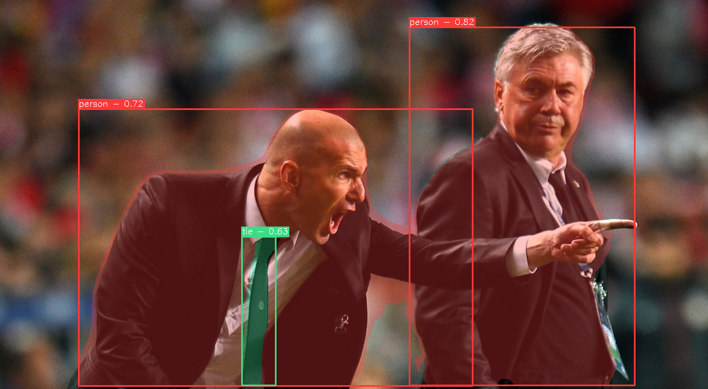
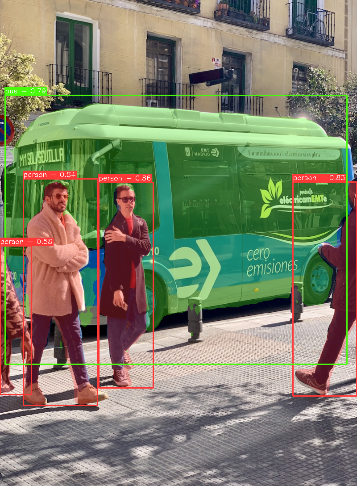

# YOLOv5 Segmentation on ONNXRUNTIME


---

Run yolov5 segmentation model on _onnxruntime_ **without torch**!

## Usage

All you need is on `segment.py`, it provides cli to run yolov5-seg onnx model.

```bash
python segment.py -- help
```

### Image

|                                |                          |
| :----------------------------: | :----------------------: |
|  |  |

```bash
python segment.py -m <YOLOV5-SEG-ONNX-PATH> -i <IMAGE-PATH>
```

### Video

|                              |                                |
| :--------------------------: | :----------------------------: |
|  |  |

```bash
python segment.py -m <YOLOV5-SEG-ONNX-PATH> -v 0            # webcam
                                               <VIDEO-PATH> # local video
```

## Run on GPU

Auto using gpu to run model when devices is supported and `onnxruntime-gpu` is installed.

**Note** : `onnxruntime-gpu` must be installed with the same version as `onnxruntime` to be
able to use GPU.

```bash
pip install onnxruntime-gpu==<YOUR-ONNXRUNTIME-VERSION>
```

## Reference

- https://github.com/ultralytics/yolov5
- https://github.com/UNeedCryDear/yolov5-seg-opencv-dnn-cpp
